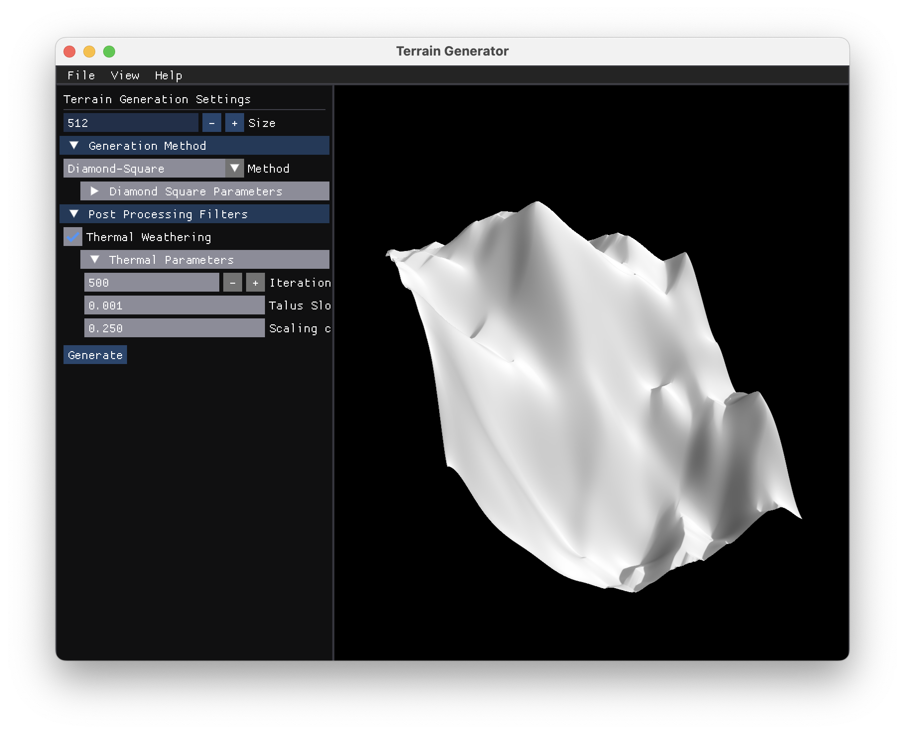

# terrainGenerator
An open-source Vulkan-powered procedural terrain generation tool with multiple algorithms and weathering effects. Useful for generating procedural meshes or UE5 landscape heightmaps.

## Screenshots





## Features
- 3 terrain generation methods: **Perlin Noise**, **Diamond-Square**, **Faulting**
- **Thermal erosion** for realisitc terrain weathering
- **Interactive Vulkan-powered editor** with intuitive camera controls
- **Export functionality**: ```.obj``` for Blender, ```.r16``` for Unreal Engine 5
- Parameter configuration via **Dear ImGui UI**

## Installation & Usage

### MacOS

Install via the ```.dmg``` file in the Releases section of this repository.

### Windows / Linux

Windows and Linux are untested, but very well may work. Clone this repository and build using CMake. If I have time, I'll look into adding release builds for these in the future.

## Example Commands / Usage
1. Launch the application.
2. Select a terrain generation method and adjust parameters in the UI.
3. Apply weathering effects and generate previews until satisfied.
4. Export your terrain as:
- ```.obj``` -> Blender
- ```.r16``` -> Unreal Engine 5

(Screenshots above show sample terrain generated with each method.)

## Technical Notes
This project was primarily made using Vulkan with supporting libraries for convenience and cross-platform support. My main motivations were to continue working with Vulkan and computer graphics while making a practical tool.  

Some implementation notes:  
- Heightmaps are stored as ```uint16_t```s to match Unreal Engine 5's .r16 format. In hindsight, I think ```float```s are a better choice for storing heights, with conversions only being done when exporting.
- ```vkDeviceWaitIdle``` is used in some places to simplify resource management; removing these could minorly improve performance.
- Weathering is rather slow at high iteration count. I'd like to go back and either multi-thread or parallelize the algorithms with compute shaders where possible.
- Some areas of the code are quite monolithic. I plan on abstracting my renderer class into subclasses and cleaning up some areas; In a previous project, I abstracted too early and too strictly which hindered my progress so I took a looser approach this time as an experiment.
- Overall, I am quite happy with the new algorithms, techniques, and libraries that I used in this project. I'm excited to add more to this project and bring these learnings to my next project.

## Possible Future Work
- Add fBm / octave options for Perlin noise
- Command-line interface (CLI) executable
- global parameters: seed, height rescaling, etc.
- GPU-based terrain generation via compute shaders
- Additional weathering and viewing options: wireframe, textures, water simulation

## License
This repository is licensed under the **MIT license**. External libraries are licensed under **Zlib** or **MIT**. See ```external/``` or ```Help > About``` inside the built application.

## Contact
Questions or comments are welcome:

Ben Wei - ben.stwei@gmail.com

Project Link: https://github.com/btwei/terrainGenerator